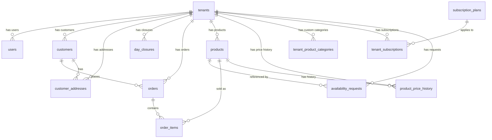

# Tijaratk Database Schema

This document details the database schema for the Tijaratk SaaS platform. The database uses **PostgreSQL** as the relational storage engine and is managed and queried through **Prisma ORM**.

---

## Entity Relationship Diagram (ERD)

The following Mermaid diagram shows the relationships between different entities in the system.

---

## Tables & Models Reference

### 1. tenants
Represents a shop or merchant tenant in the multi-tenant SaaS.

| Field Name | Type | Constraints | Description |
| :--- | :--- | :--- | :--- |
| **id** | Int | `@id`, autoincrement | Primary Key |
| **name** | String | VarChar | The name of the merchant/shop |
| **phone** | String | Unique, VarChar | Contact phone number |
| **customer_counter** | Int | Default: `0` | Incremental counter for generating merchant customer codes |
| **category** | TenantCategory | Default: `other` | Store category type (grocery, bakery, etc.) |
| **slug** | String | Unique, VarChar | Unique URL slug for the storefront (e.g. `/[slug]`) |
| **status** | TenantStatus | Default: `active` | Tenant status (active, inactive, suspended) |
| **delivery_fee** | Decimal(10,2) | Default: `0.00` | Flat delivery fee charged by this tenant |
| **delivery_available** | Boolean | Default: `true` | Indicates if delivery is supported by the store |
| **delivery_starts_at**| String | Nullable, VarChar(5) | Delivery starting hours (HH:MM) |
| **delivery_ends_at** | String | Nullable, VarChar(5) | Delivery ending hours (HH:MM) |
| **created_at** | DateTime | Default: `now()`, Timestamp(6) | Audit timestamp |
| **updated_at** | DateTime | Default: `now()`, Timestamp(6) | Audit timestamp |
| **deleted_at** | DateTime | Nullable, Timestamp(6) | Soft delete timestamp |

---

### 2. users
Merchant staff and owner accounts associated with specific tenants.

| Field Name | Type | Constraints | Description |
| :--- | :--- | :--- | :--- |
| **id** | Int | `@id`, autoincrement | Primary Key |
| **tenant_id** | Int | Foreign Key to `tenants` | Relation to the tenant |
| **phone** | String | Unique, VarChar | Phone number used for login |
| **name** | String | VarChar | Real name of the user |
| **role** | UserRole | Enum | User role (owner, staff) |
| **password** | String | VarChar | Hashed password string |
| **created_at** | DateTime | Default: `now()`, Timestamp(6) | Audit timestamp |
| **updated_at** | DateTime | Default: `now()`, Timestamp(6) | Audit timestamp |
| **deleted_at** | DateTime | Nullable, Timestamp(6) | Soft delete timestamp |

---

### 3. admin_users
Super-admin portal accounts to manage plans, tenants, and platform-wide configurations.

| Field Name | Type | Constraints | Description |
| :--- | :--- | :--- | :--- |
| **id** | Int | `@id`, autoincrement | Primary Key |
| **phone** | String | Unique, VarChar | Admin login phone number |
| **name** | String | VarChar | Name of the admin |
| **password** | String | VarChar | Hashed password string |
| **created_at** | DateTime | Default: `now()`, Timestamp(6) | Audit timestamp |
| **updated_at** | DateTime | Default: `now()`, Timestamp(6) | Audit timestamp |

---

### 4. products
Individual items created by a tenant for their online storefront catalog.

| Field Name | Type | Constraints | Description |
| :--- | :--- | :--- | :--- |
| **id** | Int | `@id`, autoincrement | Primary Key |
| **tenant_id** | Int | Foreign Key to `tenants` | Relation to the tenant |
| **name** | String | VarChar | Name of the product (usually in Arabic) |
| **image_url** | String | Nullable, VarChar | Hosted image URL for the product |
| **source** | ProductSource | Default: `manual` | Source of the product creation |
| **status** | ProductStatus | Default: `active` | Status of the product (active, archived) |
| **category** | String | Default: `"أخرى"`, VarChar(64) | Category name (local/global classification) |
| **current_price** | Decimal(10,2) | Nullable | Current price of the product |
| **order_mode** | ProductOrderMode| Default: `quantity` | Ordering style constraint (quantity, weight, price) |
| **order_config** | Json | Nullable | Order thresholds and scaling configurations |
| **is_available** | Boolean | Default: `true` | In-stock/availability toggle |
| **created_at** | DateTime | Default: `now()`, Timestamp(6) | Audit timestamp |
| **updated_at** | DateTime | Default: `now()`, Timestamp(6) | Audit timestamp |
| **deleted_at** | DateTime | Nullable, Timestamp(6) | Soft delete timestamp |

---

### 5. product_price_history
Tracks historical pricing changes for products to generate reporting or preserve transaction records.

| Field Name | Type | Constraints | Description |
| :--- | :--- | :--- | :--- |
| **id** | Int | `@id`, autoincrement | Primary Key |
| **tenant_id** | Int | Foreign Key to `tenants` (Cascade) | Relation to the tenant |
| **product_id** | Int | Foreign Key to `products` (Cascade)| Relation to the product |
| **price** | Decimal(10,2) | | Price set during this period |
| **effective_from** | DateTime | Default: `now()`, Timestamptz(6) | Start time of this price rate |
| **effective_to** | DateTime | Nullable, Timestamptz(6) | End time of this price rate (null = current) |
| **reason** | String | Nullable | Reason for updating price (e.g. discount, cost change) |

---

### 6. tenant_product_categories
Custom store categories created by a tenant to organize their showcase layout.

| Field Name | Type | Constraints | Description |
| :--- | :--- | :--- | :--- |
| **id** | Int | `@id`, autoincrement | Primary Key |
| **tenant_id** | Int | Foreign Key to `tenants` (Cascade) | Tenant owner of the category |
| **name** | String | VarChar(64) | Name of the category (Unique per tenant) |
| **created_at** | DateTime | Default: `now()`, Timestamp(6) | Audit timestamp |
| **updated_at** | DateTime | Default: `now()`, Timestamp(6) | Audit timestamp |
| **deleted_at** | DateTime | Nullable, Timestamp(6) | Soft delete timestamp |

---

### 7. catalog_items
Platform-level template product database for fast onboarding by store owners.

| Field Name | Type | Constraints | Description |
| :--- | :--- | :--- | :--- |
| **id** | Int | `@id`, autoincrement | Primary Key |
| **name** | String | VarChar | Template product name |
| **image_url** | String | Nullable, VarChar | Placeholder or default image |
| **category** | String | VarChar | Default global category classification |
| **is_active** | Boolean | Default: `true` | Status of the template item |
| **created_at** | DateTime | Default: `now()`, Timestamp(6) | Audit timestamp |
| **updated_at** | DateTime | Default: `now()`, Timestamp(6) | Audit timestamp |
| **deleted_at** | DateTime | Nullable, Timestamp(6) | Soft delete timestamp |

---

### 8. customers
Customer records built by the merchant per tenant. Customers are identified by their phone number.

| Field Name | Type | Constraints | Description |
| :--- | :--- | :--- | :--- |
| **id** | Int | `@id`, autoincrement | Primary Key |
| **tenant_id** | Int | Foreign Key to `tenants` | Relation to the tenant |
| **phone** | String | Unique per tenant, VarChar | Contact number |
| **name** | String | Nullable, VarChar | Customer's full name |
| **code** | Int | Unique per tenant | Merchant's shorthand code for the customer |
| **merchant_label** | String | Nullable, VarChar | Internal note/label by the merchant for customer |
| **address** | String | Nullable | Primary customer address |
| **notes** | String | Nullable | Specific customer notes |
| **first_order_at** | DateTime | Nullable, Timestamp(6) | Timestamp of first order placement |
| **last_order_at** | DateTime | Nullable, Timestamp(6) | Timestamp of last order activity |
| **order_count** | Int | Default: `0` | Total order count (including active/cancelled) |
| **completed_order_count** | Int | Default: `0` | Number of successfully delivered orders |
| **created_at** | DateTime | Default: `now()`, Timestamp(6) | Audit timestamp |
| **updated_at** | DateTime | Default: `now()`, Timestamp(6) | Audit timestamp |
| **deleted_at** | DateTime | Nullable, Timestamp(6) | Soft delete timestamp |

---

### 9. customer_addresses
Saved delivery addresses for customer checkout profiles.

| Field Name | Type | Constraints | Description |
| :--- | :--- | :--- | :--- |
| **id** | Int | `@id`, autoincrement | Primary Key |
| **tenant_id** | Int | Foreign Key to `tenants` | Tenant scoping |
| **customer_id** | Int | Foreign Key to `customers` (Cascade) | Customer details relation |
| **address** | String | | The raw text of the address |
| **last_used_at** | DateTime | Nullable, Timestamp(6) | Timestamp of when this address was last checked out |
| **created_at** | DateTime | Default: `now()`, Timestamp(6) | Audit timestamp |
| **updated_at** | DateTime | Default: `now()`, Timestamp(6) | Audit timestamp |
| **deleted_at** | DateTime | Nullable, Timestamp(6) | Soft delete timestamp |

---

### 10. orders
Order metadata and state tracking representing sales interactions.

| Field Name | Type | Constraints | Description |
| :--- | :--- | :--- | :--- |
| **id** | Int | `@id`, autoincrement | Primary Key |
| **tenant_id** | Int | Foreign Key to `tenants` | Relation to the tenant |
| **customer_id** | Int | Foreign Key to `customers` | Customer placing the order |
| **public_token** | String | Unique, UUID | Public token used for order tracking links |
| **order_type** | OrderType | Enum | Method of order (catalog cart, free_text list) |
| **status** | OrderStatus | Default: `draft` | Checkout workflow status |
| **pricing_mode** | PricingMode | Default: `auto` | Auto-calculated vs Manual adjustment pricing |
| **subtotal** | Decimal(10,2) | Nullable | Sum of order item totals |
| **delivery_fee** | Decimal(10,2) | Default: `0.00` | Shipping/delivery surcharge |
| **delivery_address** | String | Nullable | Selected delivery location string |
| **delivery_time_window_snapshot** | String | Nullable, VarChar(64) | Delivery time frame agreed (e.g. evening) |
| **customer_phone** | String | Nullable, VarChar | Snapshot of customer phone at checkout |
| **customer_name** | String | Nullable, VarChar | Snapshot of customer name at checkout |
| **total** | Decimal(10,2) | Nullable | Final amount due (subtotal + delivery_fee) |
| **free_text_payload** | Json | Nullable | Parsed free text orders payload (JSON structure) |
| **notes** | String | Nullable | Delivery instruction notes or user comment |
| **customer_rejection_reason** | String | Nullable | Customer comment explaining order rejection |
| **customer_rejected_at** | DateTime | Nullable, Timestamptz(6) | When the customer rejected proposed changes |
| **created_at** | DateTime | Default: `now()`, Timestamp(6) | Audit timestamp |
| **updated_at** | DateTime | Default: `now()`, Timestamp(6) | Audit timestamp |
| **deleted_at** | DateTime | Nullable, Timestamp(6) | Soft delete timestamp |

---

### 11. order_items
Individual products, quantities, prices, and status variables for ordered products.

| Field Name | Type | Constraints | Description |
| :--- | :--- | :--- | :--- |
| **id** | Int | `@id`, autoincrement | Primary Key |
| **order_id** | Int | Foreign Key to `orders` (Cascade) | Order details relation |
| **product_id** | Int | Nullable, Foreign Key to `products` | Ordered product identifier |
| **name_snapshot** | String | VarChar | Product name snapshot at checkout time |
| **quantity** | String | | Sizing requested (e.g. "2 packs", "1.5 kg") |
| **unit_price** | Decimal(10,2) | Nullable | Individual price rate applied |
| **total_price** | Decimal(10,2) | Nullable | Cumulative item cost (`quantity * unit_price`) |
| **notes** | String | Nullable | Specific instructions for this item |
| **replaced_by_product_id** | Int | Nullable, Foreign Key to `products` | Confirmed replacement product ID |
| **pending_replacement_product_id** | Int | Nullable, Foreign Key to `products` | Proposed replacement product ID |
| **replacement_decision_status** | ReplacementDecisionStatus | Default: `none` | Replacement proposal state |
| **replacement_decision_reason** | String | Nullable | Reason for replacement |
| **replacement_decided_at** | DateTime | Nullable, Timestamptz(6) | Replacement approval timestamp |
| **selection_mode** | OrderItemSelectionMode | Nullable | Selection scale constraint |
| **selection_quantity**| Decimal(10,3) | Nullable | Amount ordered scaling |
| **selection_grams** | Int | Nullable | Weight scaling (grams) |
| **selection_amount_egp**| Decimal(10,2) | Nullable | Money-amount scale (Egyptian Pounds) |
| **unit_option_id** | String | Nullable, VarChar(64) | Selected unit configuration ID |

---

### 12. availability_requests
Used to capture instances where a visitor wants to buy a currently out-of-stock product.

| Field Name | Type | Constraints | Description |
| :--- | :--- | :--- | :--- |
| **id** | Int | `@id`, autoincrement | Primary Key |
| **tenant_id** | Int | Foreign Key to `tenants` | Tenant context scope |
| **product_id** | Int | Foreign Key to `products` | Unavailable target product |
| **visitor_key** | String | VarChar(64) | Hashed cookie tracking key for client identification |
| **request_date** | DateTime | Date | Date of registration |
| **created_at** | DateTime | Default: `now()`, Timestamp(6) | Audit timestamp |
| **updated_at** | DateTime | Default: `now()`, Timestamp(6) | Audit timestamp |
| **deleted_at** | DateTime | Nullable, Timestamp(6) | Soft delete timestamp |

---

### 13. day_closures
Stores summary metrics logged by a tenant when closing out store transactions for a given workday.

| Field Name | Type | Constraints | Description |
| :--- | :--- | :--- | :--- |
| **id** | Int | `@id`, autoincrement | Primary Key |
| **tenant_id** | Int | Foreign Key to `tenants` (Cascade) | Tenant owner context |
| **closure_date** | DateTime | Unique per tenant, Date | Calendar date of closure |
| **orders_count** | Int | Default: `0` | Daily order count |
| **cancelled_count** | Int | Default: `0` | Daily cancelled order count |
| **completed_sales_total** | Decimal(10,2)| Default: `0.00` | Sum of closed orders' cash value |
| **closed_at** | DateTime | Default: `now()`, Timestamptz(6) | Exact closure lock time |
| **created_at** | DateTime | Default: `now()`, Timestamp(6) | Audit timestamp |
| **updated_at** | DateTime | Default: `now()`, Timestamp(6) | Audit timestamp |
| **deleted_at** | DateTime | Nullable, Timestamp(6) | Soft delete timestamp |

---

### 14. subscription_plans
SaaS plans defining features and monthly/yearly pricing limits for tenants.

| Field Name | Type | Constraints | Description |
| :--- | :--- | :--- | :--- |
| **id** | Int | `@id` | Primary Key |
| **name** | String | VarChar | Plan identifier (e.g. Basic, Premium) |
| **price** | Decimal(10,2) | | Price of plan subscription |
| **features** | Json | Nullable | Key-value feature toggles (limits, bot access) |
| **is_active** | Boolean | Default: `true` | Status of subscription plan availability |
| **created_at** | DateTime | Default: `now()`, Timestamp(6) | Audit timestamp |
| **updated_at** | DateTime | Default: `now()`, Timestamp(6) | Audit timestamp |

---

### 15. tenant_subscriptions
Maps tenants to subscription plans, defining periods of active service.

| Field Name | Type | Constraints | Description |
| :--- | :--- | :--- | :--- |
| **id** | Int | `@id` | Primary Key |
| **tenant_id** | Int | Foreign Key to `tenants` (Cascade) | Tenant details |
| **plan_id** | Int | Foreign Key to `subscription_plans` (Restrict) | Plan details |
| **start_date** | DateTime | Default: `now()`, Timestamptz(6) | Start of subscription coverage |
| **end_date** | DateTime | Nullable, Timestamptz(6) | End of subscription coverage (null = rolling) |
| **is_active** | Boolean | Default: `true` | State status of active plan |
| **created_at** | DateTime | Default: `now()`, Timestamp(6) | Audit timestamp |
| **updated_at** | DateTime | Default: `now()`, Timestamp(6) | Audit timestamp |

---

## Enums Detail

### ReplacementDecisionStatus
Indicates the status of a merchant-proposed replacement for an out-of-stock item.
* `none`
* `pending`
* `approved`
* `rejected`

### OrderItemSelectionMode
Units classification mode for granular selection constraints.
* `quantity`
* `weight`
* `price`

### OrderType
Order input mechanism classification.
* `catalog`: Order constructed from adding items to a storefront cart.
* `free_text`: Order submitted as a list of raw text items (e.g., copied from WhatsApp).

### PricingMode
Method used for resolving order pricing totals.
* `auto`: Automatic calculation based on prices of products in the database.
* `manual`: Manual calculation by the merchant in their dashboard.

### OrderStatus
Checkout workflow cycle states.
* `draft`: Order initiated, not finalized.
* `confirmed`: Merchant received and accepted the order.
* `out_for_delivery`: Order is out with the delivery agent.
* `completed`: Order delivered successfully.
* `cancelled`: Order cancelled.
* `rejected_by_customer`: Customer rejected the order proposals or changes.

### ProductOrderMode
Determines how customers add a product to their cart.
* `quantity`: Order by units (e.g., 2 bottles).
* `weight`: Order by weight (e.g., 1.5 kg).
* `price`: Order by price limit (e.g., 50 EGP worth of a product).

### ProductSource
Specifies how the product was registered.
* `manual`: Created by merchant via their dashboard.
* `catalog`: Cloned from platform templates.
* `order_note`: Auto-generated from free text orders parsing.

### ProductStatus
Lifecycle state of products.
* `active`: Visible on storefront.
* `archived`: Hidden from catalog search and storefront.

### TenantCategory
SaaS merchant market type.
* `grocery`
* `greengrocer`
* `butcher`
* `bakery`
* `pharmacy`
* `other`

### TenantStatus
The merchant account operating status.
* `active`
* `inactive`
* `suspended`

### UserRole
Tenant panel access scope permissions.
* `owner`: Full panel configuration and actions.
* `staff`: Operations actions (e.g. updating order status).
